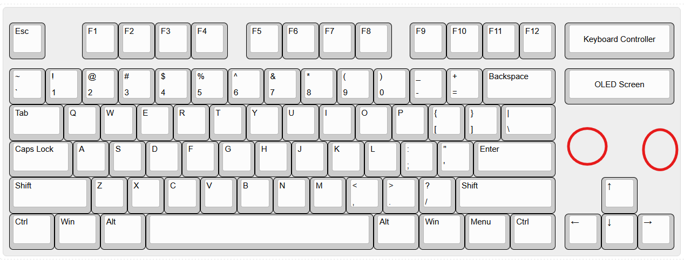
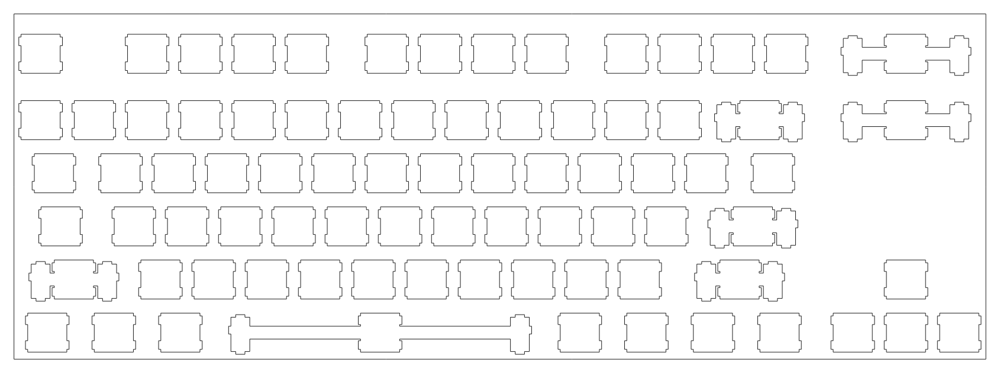

# July 20: Finalized the general concept design

First journal entry because I didn't realize they were mandatory :P 

I spent a lot of time looking at other's designs and attempting to create various mockups of what I'd want to build out, unfortunately I'm not much of artist so the final product for my vision looks real basic. 

Thanks to the creater of [Keyboard Layout Editor](https://www.keyboard-layout-editor.com/) I was able to design a gist of what I'm building out, enough to start working on the PCB without having to be a figma master.

Raw data for future reference:

[{y:0.25},"Esc",{x:1},"F1","F2","F3","F4",{x:0.5},"F5","F6","F7","F8",{x:0.5},"F9","F10","F11","F12",{x:0.25,a:7,w:3},"Keyboard Controller"],
[{y:0.25,a:4},"~\n`","!\n1","@\n2","#\n3","$\n4","%\n5","^\n6","&\n7","*\n8","(\n9",")\n0","_\n-","+\n=",{w:2},"Backspace",{x:0.25,a:7,w:3},"OLED Screen"],
[{a:4,w:1.5},"Tab","Q","W","E","R","T","Y","U","I","O","P","{\n[","}\n]",{w:1.5},"|\n\\"],
[{w:1.75},"Caps Lock","A","S","D","F","G","H","J","K","L",":\n;","\"\n'",{w:2.25},"Enter"],
[{w:2.25},"Shift","Z","X","C","V","B","N","M","<\n,",">\n.","?\n/",{w:2.75},"Shift",{x:1.25},"↑"],
[{w:1.25},"Ctrl",{w:1.25},"Win",{w:1.25},"Alt",{a:7,w:6.25},"",{a:4,w:1.25},"Alt",{w:1.25},"Win",{w:1.25},"Menu",{w:1.25},"Ctrl",{x:0.25},"←","↓","→"]

And using [this builder](http://builder.swillkb.com/) I was able to generate the switch layer

**Total time spent: 2 hours**

# July 20 (continued): Finished the keyboard matrix and updated design

I worked on getting the keymatrix finished, afterwards I had a little panick because I realized my accessories would be *just* over the limit for the raspberry pi Pico.

I looked at a bunch of different boards with various requierements, I wasn't able to find anything that was applicable to my skill level *and* price conscious until my friend pulled me back to my sense T-T

I also started a parts list in my readme, I have a fairly solid outlook on the keyboard, making good progress : )

**Total time spent: 4 hours**

